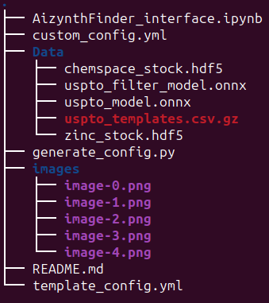
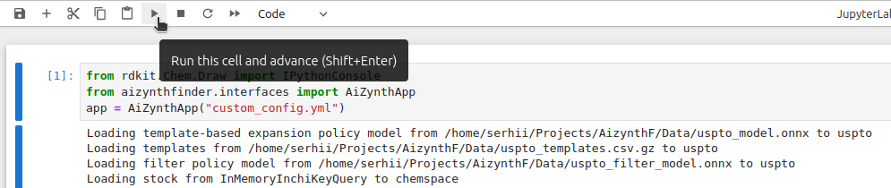
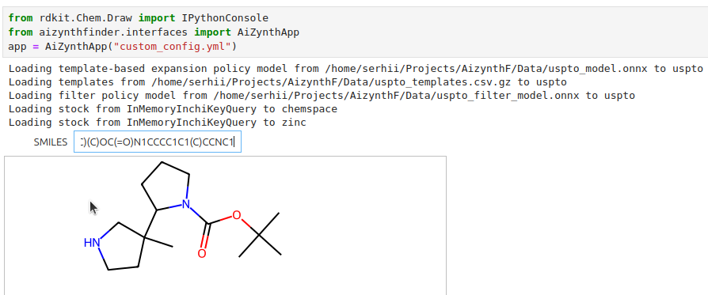
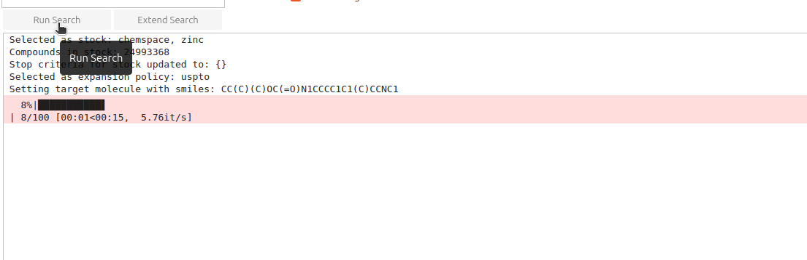
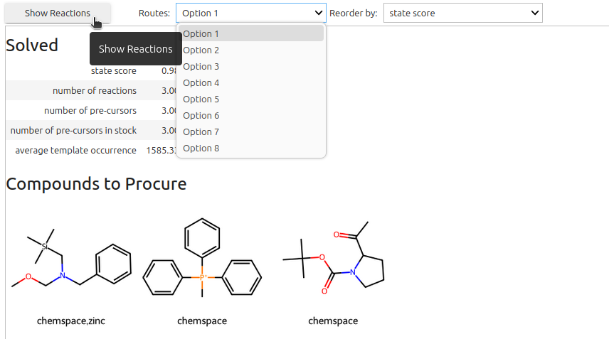
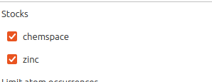

# AizynthFinder
## Installation  of neccessary software for LINUX operation system

### Installing Python on Ubuntu Linux

This guide will walk you through the process of installing Python on Ubuntu Linux using the `apt` package manager.

#### Prerequisites

- Ubuntu Linux installed on your system.
- Access to the terminal.

### Installation Steps

1. **Update Package Index:**
   Open a terminal window by pressing `Ctrl+Alt+T` and run the following command to update the package index:

   ```bash
   sudo apt update 
   ```
   Enter the password of your Linux account
### Install Python

Once the update is complete, install Python3 by running  the following command:
```bash
sudo apt install python3
```
### Verify Installation

After the installation is complete, verify Python installation by checking the version. Run the following command:

```bash
python3 --version
```

## Installing Anaconda on Ubuntu Linux

Anaconda is a popular distribution of Python and R programming languages for scientific computing, data science, and machine learning.

### Installation Steps

1. **Download Anaconda:**
   Visit the [Anaconda website](https://www.anaconda.com/products/distribution) and download the appropriate version of Anaconda for Linux.

2. **Open Terminal:**
   Once the download is complete, open a terminal window by pressing `Ctrl+Alt+T`.

3. **Navigate to Download Directory:**
   Navigate to the directory where the Anaconda installer script was downloaded. This is usually the `Downloads` directory. You can navigate using the `cd` command:

   ```bash
   cd ~/Downloads
   ```
4. **Run Installer Script:**

    Run the Anaconda installer script using the following command. Replace `Anaconda3-2024.02-1-Linux-x86_64.sh` with the actual filename of the Anaconda installer you downloaded (in case it differs):

    ```bash
    bash Anaconda3-2024.02-1-Linux-x86_64.sh
    ```

5. **Follow Installer Prompts**

    Follow the prompts in the installer. You can press `Enter` to scroll through the license agreement. When prompted, type `yes` to agree to the license terms and proceed with the installation.

6. **Choose Installation Location**

    When prompted for the installation location, it's recommended to accept the default location. Press `Enter` to confirm.

7. **Initialize Anaconda**

    After the installation is complete, initialize Anaconda by running the following command:

    ```bash
    source ~/.bashrc
    ```

8. **Verify Installation**

    Verify the installation by running the following command to check the Anaconda version:

    ```bash
    conda --version
    ```


## Installation of AIZynthFinder

1. Create a Conda environment named `aizynth-env` with Python version 3.8 to 3.10:

    ```bash
    conda create -n aizynth-env "python>=3.8,<3.10"
    ```
    Press 'Y' when prompted to proceed.

2. Activate the environment:

    ```bash
    conda activate aizynth-env
    ```

3. Install Aizynthfinder with all dependencies:

    ```bash
    python -m pip install aizynthfinder[all]
    ```

    It may take some time, and the required space is approximately 4.2 GB (it will be installed in the Anaconda environment).


4. Install ipywidgets version 8.0.0 to prevent problem with loading widgets in jupyter notebook:

    ```bash
    pip install ipywidgets==8.0.0
    ```

5. Create a folder for models and important files. For example, AizynthF:

```bash
mkdir AizynthF
cd AizynthF
git clone https://github.com/ChemSpaceAI/AizynthFinder_installation_guide.git
cd AizynthFinder_installation_guide
```

6. Download the and unzip data, which includes trained models, policy, zinc and chemspace  stocks from zip file [Zip_File](data.zip) and move them into the newly created folder. (link to the zip file with stock will be attached to the message)

7. Generate the custom_file.yml by running the script:
```bash
python generate_config.py
```
8. The general structure of the main directory should look like this :



## Graphical User Interface

### Running from the command line

1. Ensure you're in the activated `aizynth-env` Conda environment.

2. Navigate to the directory containing your `custom_config.yml` file.

3. Run the following command to automatically open Jupyter Notebook:

```bash
aizynthapp --config custom_config.yml
```
Once Jupyter Notebook opens, press the play button to start working with the program.

If the above command fails:

1. Run the following command first:

```bash
jupyter-notebook
```
2. Copy and paste one of the generated URLs in your browser.

3. Open the notebook [AizynthFinder_interface.ipynb](AizynthFinder_interface.ipynb).

Once opened, press the play button to start working with the program.

(Note: It's preferable to use the second way of launching the tool)

## How to use the tool
1. **Start the program**



2. **Insert the SMILES and press Enter**



3. **Click on the "Run Search" button and wait until it's over**



4. **Click on the "Show Reactions" button**



5. **It's also possible to exclude zinc stock from the search**



##
